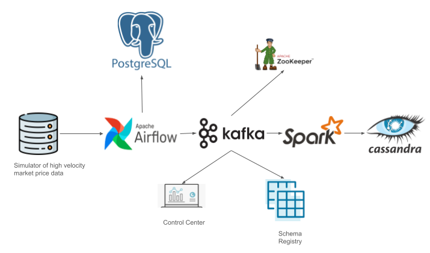

For the project, we'll create a Kappa architecture that can handle at least 4GB of streaming market price data per day. The architecuture will handle approximately 800 tickers with each ticker delivering information at varying rates. The system will evaluate the system for buy/sell signals. Note that we will not focus on the particular machine learning algorithm used. Hence the student is free to create their own algorithm. The architecture for this example project is using a **Kappa Architecture** and is shown in the image below.

The **Kappa Architecture** is a data architecture pattern uses a single stream processing layer for both real-time and batch processing of data. In the context of streaming market data, the architecture can be designed using a combination of technologies like **Apache Kafka**, **Apache Spark**, **TimescaleDB**, **Cassandra**, **Zookeeper**, and a **Schema Registry** to achieve high throughput, fault tolerance, and scalability. Below is a detailed description of how these components can fit into a Kappa Architecture for streaming market data.

### 1. **Data Ingestion Layer (Kafka + Schema Registry + Zookeeper)**
The first step in the Kappa architecture is to ingest the streaming market data into the system. This is typically done through **Apache Kafka**, a distributed streaming platform that can handle high-throughput and low-latency data ingestion. Kafka works well for both real-time processing and fault-tolerant storage.

- **Kafka Producers**: These are the market data sources, such as stock market feeds, cryptocurrency prices, or financial transactions. Producers publish market events (e.g., price updates, trades, tickers) to Kafka topics.
- **Kafka Brokers**: Kafka brokers manage the message streams and ensure that the data is distributed and replicated across Kafka partitions. They ensure fault tolerance and scalability.
- **Kafka Consumers**: Consumers read the data from Kafka topics. In this case, it could be a **Spark Streaming** job or other downstream processing systems.

The **Schema Registry** (e.g., Confluent Schema Registry) is used to manage and enforce schemas for the Kafka messages. This ensures that all market data events are serialized consistently (e.g., Avro format) and provides version control for the schemas. The **Schema Registry** validates the incoming data against predefined schemas, preventing issues related to incompatible changes in data structures.

**Zookeeper** is used for managing the Kafka cluster’s metadata, leader elections, and other distributed coordination tasks. It ensures that Kafka remains highly available and resilient.

### 2. **Stream Processing Layer (Apache Spark)**
At the core of the Kappa Architecture is the **stream processing engine**. In this case, **Apache Spark** is used to process the market data in real-time. Spark provides powerful stream processing capabilities through its **Structured Streaming** API, which can process large amounts of real-time data with low latency.

- **Spark Streaming** reads data from the Kafka topics, performs transformations and computations on the incoming market data, and outputs processed data to downstream storage systems.
- **Processing tasks** could include aggregations, filtering, joins, windowing operations (e.g., calculating moving averages for stock prices), and more.
- Spark can also handle late-arriving data, manage windowing for time-based operations, and scale horizontally to handle large volumes of data.

### 3. **Storage Layer (Postgresql + Cassandra)**
The processed data can be stored in multiple databases depending on the use case and data type.

- **PostresSQL**: an open-source, object-relational database management system known for its stability, scalability, and extensibility. It supports advanced data types like JSON, arrays, and custom types, offering powerful querying capabilities and compliance with SQL standards. PostgreSQL is widely used in both small and large applications due to its robust performance, strong community support, and active development.
  - **Use case**: Storing price history, price charts, and market events, with the ability to query historical data with high performance.
  
- **Cassandra**: Apache Cassandra is a distributed NoSQL database designed for high availability and scalability. It excels in handling massive amounts of write-heavy data and can be used to store event logs or real-time market transactions, where consistency is relaxed in favor of availability and partition tolerance.
  - **Use case**: Storing high-frequency event data like trade logs, real-time order book updates, or tick-level data.

Both **PostresSQL** and **Cassandra** can scale horizontally and provide fault tolerance, ensuring the system is highly available and can handle increasing volumes of data over time.

### 4. **Data Serving and Real-time Query Layer**
After processing, the data can be served to different consumers like dashboards, analytic tools, or even machine learning models.

- For **real-time querying**, tools like **TimescaleDB** can be directly queried to fetch the latest market data (e.g., current prices, aggregated statistics).
- For **batch or analytical queries**, **Cassandra** can be used to store raw event data that can later be analyzed in bulk, with tools like **Apache Spark** used to periodically aggregate this data.
- For **visualization**, tools like **Grafana** or **Tableau** can be used to query TimescaleDB for time-series visualizations. Due to time constriants, the visualization component was not proposed as part of the  project.

### 5. **Data Quality and Monitoring**
Monitoring the quality of the data, performance of the streaming pipeline, and error handling is crucial in a real-time data architecture.

- **Apache Airflow** can be used to orchestrate and monitor batch processes or offline jobs. For example, Airflow can schedule periodic jobs to clean, aggregate, or transform historical data stored in **Cassandra** or **PostresSQL**.
- **Metrics** and **logs** can be collected from Kafka, Spark, and the databases (TimescaleDB and Cassandra) to monitor the system’s performance and data quality.

### 6. **Fault Tolerance & Scalability**
- **Kafka’s partitioning** and **replication** ensure fault tolerance by replicating data across multiple brokers.
- **Spark** provides fault tolerance via its **checkpointing** and **stateful processing** capabilities. In case of failure, Spark can resume processing from the last checkpoint.
- **TimescaleDB** and **Cassandra** can scale horizontally across nodes and provide high availability.

### Workflow Summary:
1. **Market data sources (e.g., stock price updates, trading events)** are ingested into **Apache Kafka** via producers.
2. **Kafka brokers** manage the data streams and make it available for consumption by downstream systems.
3. Data is consumed by **Apache Spark** for real-time stream processing, such as aggregation, transformation, and enrichment.
4. The processed data is stored in **TimescaleDB** (for time-series data) and **Cassandra** (for event data) for later querying and analytics.
5. A **Schema Registry** ensures consistent message formats across the Kafka topics.
6. **Apache Airflow** manages the orchestration of batch or offline jobs for further processing or maintenance tasks.

### Conclusion
This Kappa Architecture for streaming market data leverages the real-time data processing capabilities of Apache Kafka, Apache Spark, and the storage efficiencies of TimescaleDB and Cassandra. Using a schema registry ensures the consistency of message formats, while Apache Airflow facilitates data pipeline orchestration. This design is highly scalable, fault-tolerant, and suited for high-throughput environments like market data streaming.
